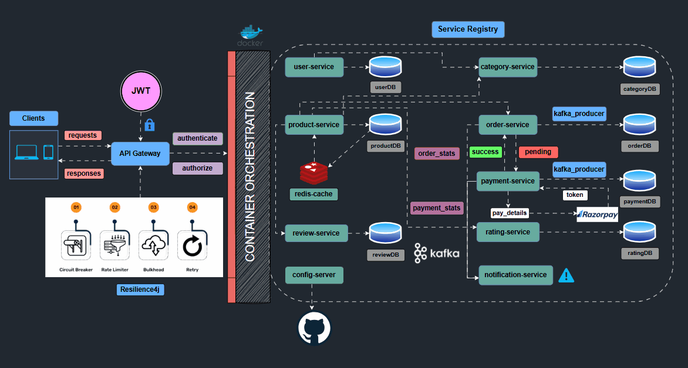

# Full Stack E-commerce Application 🛒

## The ultimate full stack E-commerce application

### 🛠 <i> Languages and Tools </i>

### 📄 <i> Front-end Technologies </i>

### ⚙️ <i> Back-end Technologies </i>

## 🧑‍💻 About

This is a full-stack E-commerce application that is implemented with event-driven and independent microservices.

## Architectural Diagram:

## 📦 Microservices Overview

| Service           | Description                | Tech Stack                         | Documentation                             |
|-------------------|---------------------------|-------------------------------------|--------------------------------------------|
| API Gateway       | Entry point & Auth         | Spring Cloud Gateway                | [API Gateway](api-gateway/README.md)       |
| User Service      | User management            | Spring Boot, MongoDB                | [User Service](user-service/README.md)     |
| Product Service   | Product catalog & search   | Spring Boot, MySQL, Elasticsearch   | [Product Service](product-service/README.md)|
| Cart Service      | Shopping cart management   | Vert.x, Redis                       | [Cart Service](cart-service/README.md)     |
| Order Service     | Order processing           | Spring Boot, MongoDB                | [Order Service](order-service/README.md)   |
| Payment Service   | Payment processing         | Vert.x, MongoDB                     | [Payment Service](payment-service/README.md)|
| Category Service  | Product categories         | Spring Boot, MySQL                  | [Category Service](category-service/README.md)|
| Config Server     | Centralized configs        | Spring Cloud Config                 | [Config Server](config-server/README.md)   |
| Service Registry  | Service discovery          | Eureka Server                       | [Service Registry](service-registry/README.md)|

---

## 🛠️ Technical Stack

Backend Technologies

- ☕ Java 17+
- 🍃 Spring Boot & Spring Cloud
- 🛡️ Spring Security
- 🔄 Eclipse Vert.x
- 📊 MongoDB, MySQL
- 📨 Apache Kafka
- 🚀 Redis
- 🔍 Elasticsearch
- 📝 Swagger/OpenAPI

Frontend Technologies

- ⚛️ React.js & Redux
- 🎨 React Bootstrap
- 📱 Responsive Design
- 📡 Axios

---

## 🗺️ System Architecture

The system is designed with a modular microservices approach for scalability, maintainability, and resilience.
- **API Gateway:**
  Central entry point for all client requests. Handles SSL termination, traffic routing, authentication, and request throttling.
- **Config Server:**
  Central management for configurations of all microservices, supporting dynamic refresh and secure secret delivery.
- **Service Registry:**
  Maintains a dynamic registry of all running microservices for client-side load balancing and service-to-service discovery.
- **Individual Microservices:**
  Each domain feature (User, Product, Cart, Order, Payment, Category) is isolated in its own codebase and database, communicating mostly via REST (HTTP) and asynchronous messaging (Kafka).
- **Inter-service Communication:**
    - REST APIs (internal and external)
    - Event-driven via Kafka for decoupled, scalable workflows (e.g., order placed, payment processed)

- **Databases:**
    - Polyglot persistence: Each service owns its schema using the best storage type for the use case (MongoDB, MySQL, Redis, etc.)
    - Completely decoupled storage for ease of scaling and safety

- **Monitoring & Observability:**
  Spring Boot Actuator and Micrometer enable runtime health checks, tracing, and metrics.
- **Frontend:**
  React-based SPA, talks exclusively through the API Gateway.

---

## 🚦 Service Documentation

Each microservice has its own `README.md` for more detailed configuration, endpoints, and schema.  
👉 **Navigate to individual service folders for deeper API details, request/response examples, and diagrams.**

---

## 🏁 Getting Started

See [Deployment Guide](docs/DEPLOYMENT.md) or read each service's README for setup and usage.

---

## 📚 Contributing & License

- See [CONTRIBUTING.md](CONTRIBUTING.md)
- License: MIT

---
