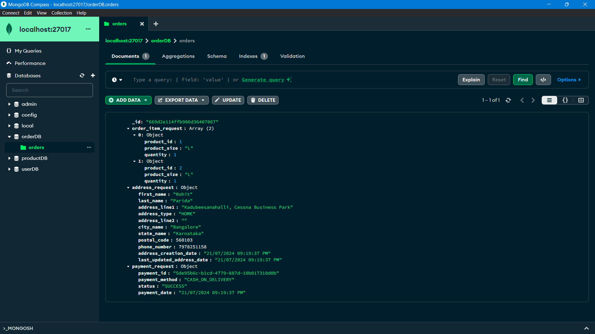

# Order-service

[](https://vertx.io)

## Vert.x and Spring Boot Integration with Spring Cloud

#### This is a reactive microservice developed with Vert.x using rxjava3.

#### This application was generated using http://start.vertx.io

## Request Payload:

```JSON
{
  "order_item_request": [
    {
      "product_id": 1,
      "product_size": "L",
      "quantity": "1"
    },
    {
      "product_id": 2,
      "product_size": "L",
      "quantity": "1"
    }
  ],
  "address_request": {
    "first_name": "Rohit",
    "last_name": "Parida",
    "address_line1": "Kadubeesanahalli, Cessna Business Park",
    "address_type": "HOME",
    "address_line2": "",
    "city_name": "Bangalore",
    "state_name": "Karnataka",
    "postal_code": "560103",
    "phone_number": "7978251158"
  },
  "payment_request": {
    "payment_method": "CASH_ON_DELIVERY",
    "status": "SUCCESS"
  }
}
```

## Order In DB:



## Building

To launch your tests:

```
./mvnw clean test
```

To package your application:

```
./mvnw clean package
```

To run your application:

```
./mvnw clean compile exec:java
```

## Help

* https://vertx.io/docs/[Vert.x Documentation]
* https://stackoverflow.com/questions/tagged/vert.x?sort=newest&pageSize=15[Vert.x Stack Overflow]
* https://groups.google.com/forum/?fromgroups#!forum/vertx[Vert.x User Group]
* https://discord.gg/6ry7aqPWXy[Vert.x Discord]
* https://gitter.im/eclipse-vertx/vertx-users[Vert.x Gitter]


